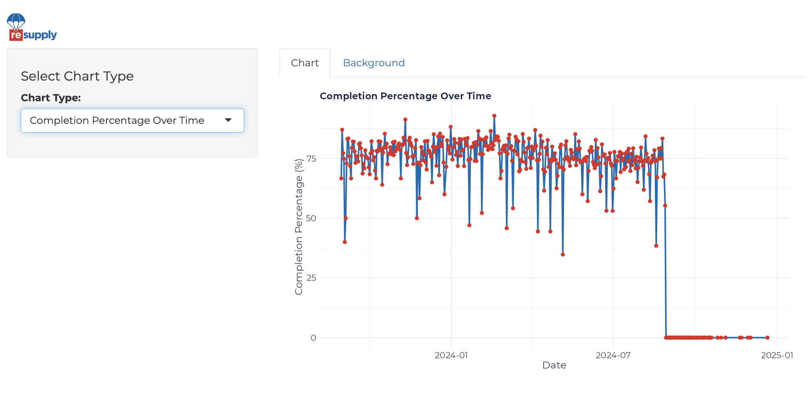

# reSupply Data Scientist Assessment

This repository contains all the necessary files and scripts to showcase the dashboard and data wrangling SQL for the assessment.

## Contents

- **app.R**: Shiny App script for dashboard
- **sqlQueries.sql**: SQL queries for data wrangling
- **videoTour.mp4**: Guided video tour of the dashboard UI
- **exportedData.csv**: Result of SQL query to combine tables

## Details

### 1. Shiny App - `app.R`
This script contains the code to launch a Shiny dashboard. The app provides visual insights based on the given dataset. You can run this app locally by ensuring you have R and the required libraries installed.

### 2. SQL Queries - `sqlQueries.sql`
This file includes all the SQL queries used for data wrangling. The queries transform raw data into a format suitable for analysis and visualization in the dashboard.

### 3. Guided Video Tour - `videoTour.mp4`
This video gives a thorough walkthrough of the dashboard's UI.

### 4. Exported Data - `exportedData.csv`
The final dataset resulting from the SQL queries is stored in this CSV file. This combined table is used as the primary data source for the dashboard.

## How to Run the Shiny App

1. **Clone the repository**

2. **Open RStudio and load the app.R file**

3. **Install required packages**

4. **Run the app**
shiny::runApp('app.R')
